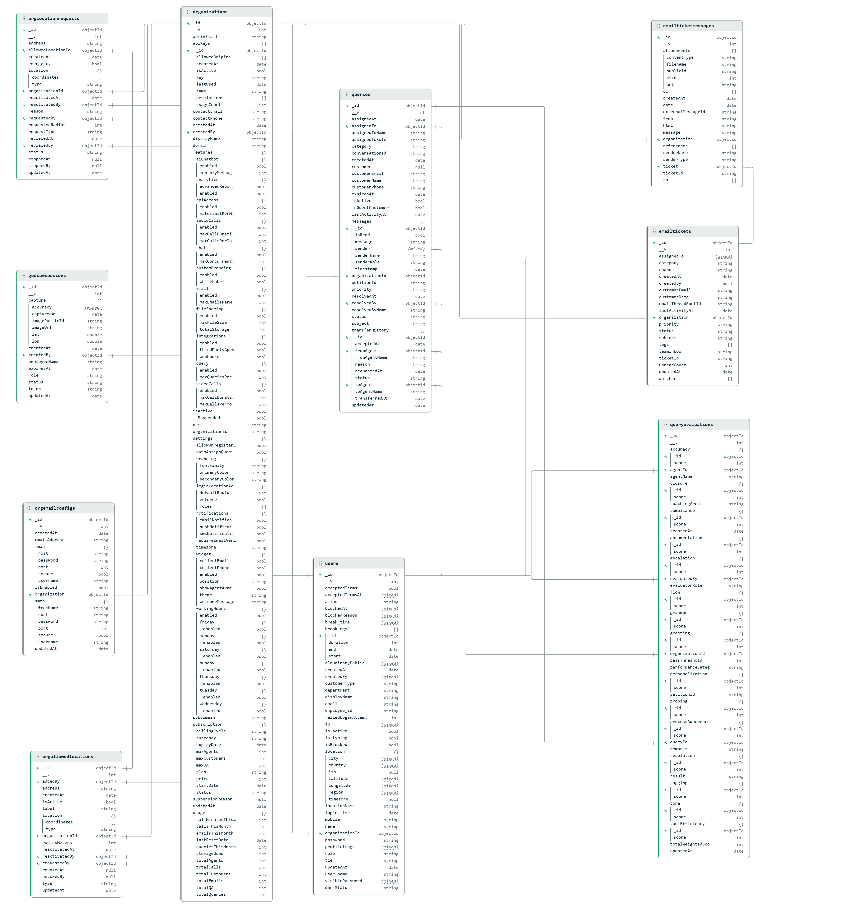
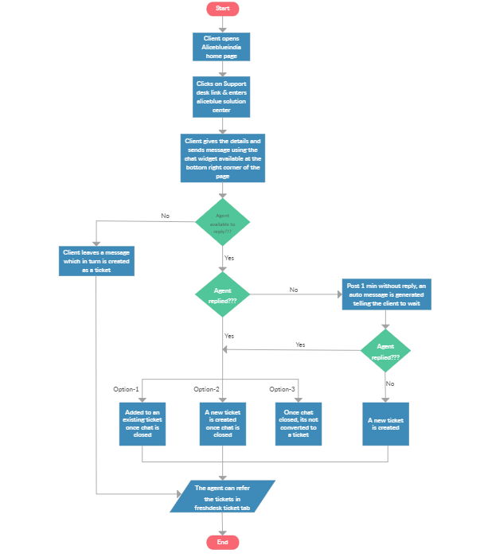
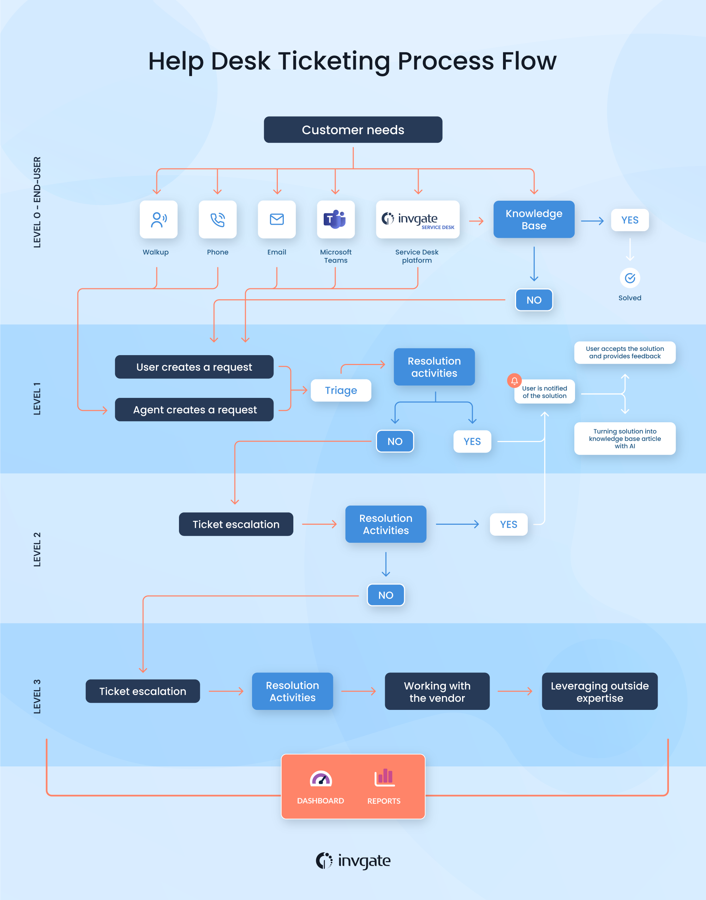
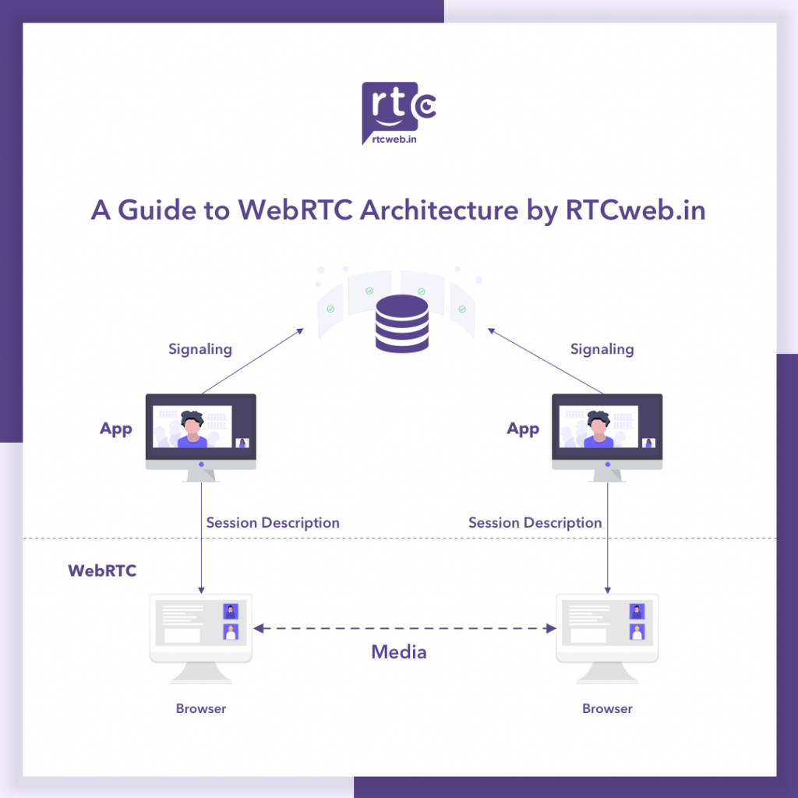
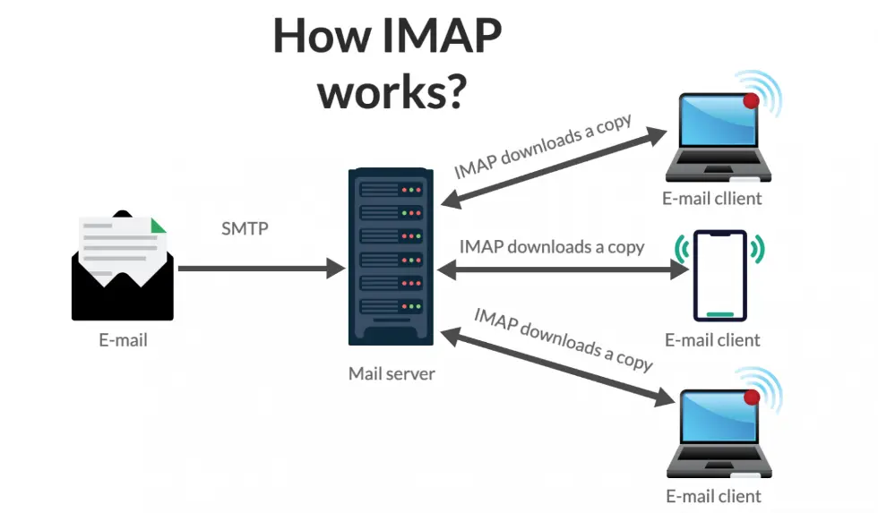

# 🚀 CHAT-CRM Backend API

[](https://nodejs.org/)
[](https://expressjs.com/)
[](https://www.mongodb.com/)
[](https://socket.io/)
[](https://redis.io/)

> **Enterprise-grade multi-tenant CRM backend with real-time communication, advanced query management, and role-based access control**

## 📑 Table of Contents

- [About](#about)
- [Key Features](#key-features)
- [Tech Stack](#tech-stack)
- [System Architecture](#system-architecture)
- [Project Structure](#project-structure)
- [Installation](#installation)
- [Configuration](#configuration)
- [Usage](#usage)
- [API Documentation](#api-documentation)
- [Database Schema](#database-schema)
- [Socket Events](#socket-events)
- [Security Features](#security-features)
- [Scripts](#scripts)
- [Testing](#testing)
- [Deployment](#deployment)
- [Contributing](#contributing)
- [License](#license)

---

## 🎯 About

**CHAT-CRM Backend** is a robust, scalable Node.js/Express API server designed to power multi-tenant customer relationship management systems. Built with enterprise-level security, real-time communication capabilities, and comprehensive role-based access control.

### What Makes This Backend Special?

- **🏢 Multi-Tenant Architecture**: Complete organization isolation with shared infrastructure
- **⚡ Real-Time Communication**: Socket.io with Redis adapter for horizontal scaling
- **🔐 Advanced Security**: JWT authentication, role-based access, location-based login enforcement
- **📧 Email Ticketing**: Automated IMAP email processing and ticket creation
- **🌍 Geolocation & IP Control**: Location radius validation and IP whitelisting
- **📊 Query Management**: Sophisticated query routing, assignment, and tracking system
- **🎥 Video/Audio Calls**: WebRTC signaling server for peer-to-peer communication
- **📈 Analytics & Reporting**: Comprehensive metrics and performance tracking

---

## ✨ Key Features

### 🔒 Security & Authentication
- **JWT-based authentication** with secure token management
- **Role-based authorization** (SuperAdmin, Admin, TL, QA, Agent, Customer)
- **Location-based login enforcement** with configurable radius
- **IP whitelisting** for organizational access control
- **Password hashing** with bcrypt
- **Rate limiting** to prevent brute-force attacks
- **Helmet.js** for HTTP header security
- **HPP protection** against parameter pollution

### 💬 Real-Time Communication
- **Socket.io bidirectional messaging** with Redis adapter
- **Room-based chat system** with typing indicators
- **WebRTC signaling** for video/audio calls
- **Real-time notifications** for queries, calls, and assignments
- **Online status tracking** with presence management
- **Message read receipts** and delivery status

### 📧 Email Ticketing System
- **Automated IMAP email fetching** from configured mailboxes
- **Smart email-to-ticket conversion** with parsing
- **Attachment handling** via Cloudinary
- **Thread management** for email conversations
- **Email reply integration** via SMTP (Nodemailer)

### 🎯 Query Management
- **Multi-source query creation** (chat, email, manual)
- **Intelligent query routing** based on skills and availability
- **Priority-based assignment** (Low, Medium, High, Urgent)
- **Query lifecycle tracking** (Open, Assigned, In Progress, Resolved, Closed)
- **Transfer capabilities** between agents and teams
- **Query history and audit trail**

### 👥 User Management
- **Multi-role user system** with organization hierarchy
- **Agent performance tracking** (queries resolved, avg resolution time)
- **Shift management** with clock in/out
- **Permission granularity** per role
- **User profile with avatar uploads**

### 📍 Location & Access Control
- **Geolocation validation** for employee logins
- **IP-based access control** with whitelist management
- **Location radius configuration** (10-10000 meters)
- **Role-specific location requirements**
- **Admin/SuperAdmin control panel** for enforcement

### 📊 Analytics & Reporting
- **Dashboard metrics** (total queries, resolved, pending, agents online)
- **Performance analytics** per agent and team
- **Query resolution time tracking**
- **Customer satisfaction tracking** (planned)
- **Export capabilities** to Excel/CSV

---

## 🛠️ Tech Stack

### Core Framework
- **Node.js** (v18+) - JavaScript runtime
- **Express.js** (v5+) - Web application framework
- **Socket.io** (v4.8) - Real-time bidirectional communication

### Database & Caching
- **MongoDB** (v8+) with Mongoose ODM - Primary database
- **Redis** (v5+) - Session storage, Socket.io adapter, caching

### Authentication & Security
- **JWT (jsonwebtoken)** - Token-based authentication
- **bcrypt** - Password hashing
- **Helmet** - Security headers
- **express-rate-limit** - API rate limiting
- **HPP** - HTTP Parameter Pollution protection

### File Storage & Processing
- **Cloudinary** - Cloud-based image/file storage
- **Multer** - Multipart form data handling
- **Streamifier** - Stream processing utilities

### Email Processing
- **IMAP** - Email fetching from mailboxes
- **imap-simple** - Simplified IMAP operations
- **Nodemailer** - SMTP email sending
- **mailparser** - Email parsing and extraction

### Utilities
- **Moment.js** - Date/time manipulation
- **moment-timezone** - Timezone handling
- **geoip-lite** - IP geolocation
- **axios** - HTTP client
- **uuid** - Unique identifier generation
- **otp-generator** - OTP generation
- **xlsx** - Excel file operations

### Development Tools
- **Nodemon** - Auto-restart on file changes
- **dotenv** - Environment variable management

---

## 🏗️ System Architecture

```
┌─────────────────────────────────────────────────────────────────┐
│                         Load Balancer                            │
└─────────────────────────────────────────────────────────────────┘
                              │
        ┌─────────────────────┼─────────────────────┐
        │                     │                     │
┌───────▼───────┐     ┌───────▼───────┐     ┌──────▼──────┐
│  Node Server  │     │  Node Server  │     │ Node Server │
│  Instance 1   │     │  Instance 2   │     │ Instance 3  │
└───────┬───────┘     └───────┬───────┘     └──────┬──────┘
        │                     │                     │
        └─────────────────────┼─────────────────────┘
                              │
                    ┌─────────▼─────────┐
                    │  Redis Adapter    │
                    │  (Socket.io PubSub)│
                    └─────────┬─────────┘
                              │
        ┌─────────────────────┼─────────────────────┐
        │                     │                     │
┌───────▼───────┐     ┌───────▼───────┐     ┌──────▼──────┐
│   MongoDB     │     │     Redis     │     │  Cloudinary │
│   (Primary)   │     │    (Cache)    │     │  (Storage)  │
└───────────────┘     └───────────────┘     └─────────────┘
```

### Request Flow

1. **Authentication Layer**: JWT token validation
2. **Authorization Layer**: Role-based access control
3. **Business Logic**: Controllers handle operations
4. **Data Layer**: Mongoose models interact with MongoDB
5. **Real-Time Layer**: Socket.io emits events to connected clients
6. **Cache Layer**: Redis stores sessions and Socket.io state

---

## 📂 Project Structure

```
CHAT-CRM-BACKEND/
├── src/
│   ├── app.js                      # Main application entry point
│   ├── config/
│   │   ├── cloudinary.js           # Cloudinary configuration
│   │   ├── db.js                   # MongoDB connection
│   │   ├── redis.js                # Redis client setup
│   │   └── socketConfig.js         # Socket.io configuration
│   ├── controllers/
│   │   ├── admin.auth.controller.js     # Admin authentication
│   │   ├── admin.controller.js          # Admin operations
│   │   ├── user.auth.controller.js      # User authentication
│   │   ├── chat.controller.js           # Chat operations
│   │   ├── query.controller.js          # Query management
│   │   ├── location.controller.js       # Location validation
│   │   ├── emailConfig.controller.js    # Email ticketing config
│   │   ├── notification.controller.js   # Notifications
│   │   ├── admin/                       # Admin-specific controllers
│   │   ├── agent/                       # Agent-specific controllers
│   │   └── superadmin/                  # SuperAdmin controllers
│   ├── models/
│   │   ├── User.js                 # User schema
│   │   ├── Organization.js         # Organization schema
│   │   ├── Query.js                # Query schema
│   │   ├── Chat.js                 # Chat message schema
│   │   ├── Room.js                 # Chat room schema
│   │   ├── Location.js             # Location record schema
│   │   ├── IPWhitelist.js          # IP whitelist schema
│   │   ├── EmailConfig.js          # Email config schema
│   │   ├── Notification.js         # Notification schema
│   │   └── FAQ.js                  # FAQ schema
│   ├── routes/
│   │   ├── admin.routes.js         # Admin API routes
│   │   ├── superadmin.routes.js    # SuperAdmin API routes
│   │   ├── agent.routes.js         # Agent API routes
│   │   ├── auth.routes.js          # Authentication routes
│   │   ├── chat.routes.js          # Chat routes
│   │   ├── query.routes.js         # Query routes
│   │   └── ...                     # Other route files
│   ├── middleware/
│   │   ├── auth.js                 # JWT authentication
│   │   ├── authorize.js            # Role-based authorization
│   │   ├── upload.js               # Multer file upload
│   │   └── errorHandler.js         # Error handling
│   ├── socket/
│   │   └── socketManager.js        # Socket.io event handlers
│   ├── sockets/
│   │   ├── chatSocket.js           # Chat Socket events
│   │   ├── callSocket.js           # WebRTC signaling
│   │   └── notificationSocket.js   # Notification events
│   ├── email-ticketing/
│   │   ├── emailFetcher.js         # IMAP email fetching
│   │   ├── emailProcessor.js       # Email-to-ticket conversion
│   │   └── emailSender.js          # SMTP email sending
│   ├── utils/
│   │   ├── jwt.js                  # JWT utilities
│   │   ├── locationUtils.js        # Geolocation helpers
│   │   ├── ipUtils.js              # IP validation helpers
│   │   └── logger.js               # Logging utilities
│   └── assets/
│       └── images/                 # Documentation images
├── uploads/                        # Temporary file uploads
│   ├── profile/                    # Profile pictures
│   ├── snapshot/                   # Call snapshots
│   └── call-screenshots/           # Video call screenshots
├── scripts/
│   ├── createSuperAdmin.js         # SuperAdmin creation script
│   └── createSuperAdminDirect.js   # Direct DB SuperAdmin creation
├── seed.js                         # Database seeding script
├── package.json                    # Dependencies
├── .env                            # Environment variables
├── .gitignore                      # Git ignore rules
├── README.md                       # This file
├── DEPLOYMENT.md                   # Deployment guide
└── QUICK_START_GUIDE.md            # Quick start guide

```

---

## 🚀 Installation

### Prerequisites

- **Node.js** v18 or higher
- **MongoDB** v8 or higher (local or cloud)
- **Redis** v5 or higher (local or cloud)
- **npm** or **yarn** package manager

### Step-by-Step Setup

1. **Clone the repository**
   ```bash
   git clone https://github.com/amit-bitmax/chatcrmapi.git
   cd CHAT-CRM-BACKEND
   ```

2. **Install dependencies**
   ```bash
   npm install
   ```

3. **Configure environment variables**
   ```bash
   cp .env.example .env
   # Edit .env with your configuration
   ```

4. **Start MongoDB** (if running locally)
   ```bash
   mongod --dbpath /path/to/data/db
   ```

5. **Start Redis** (if running locally)
   ```bash
   redis-server
   ```

6. **Seed the database** (optional)
   ```bash
   npm run seed
   ```

7. **Create SuperAdmin account**
   ```bash
   node scripts/createSuperAdmin.js
   ```

8. **Start the development server**
   ```bash
   npm run dev
   ```

The API server will start on `http://localhost:5000` (or your configured PORT).

---

## ⚙️ Configuration

### Environment Variables

Create a `.env` file in the root directory with the following variables:

| Variable | Description | Example |
|----------|-------------|---------|
| `PORT` | Server port | `5000` |
| `MONGODB_URI` | MongoDB connection string | `mongodb://localhost:27017/chatcrm` |
| `REDIS_URL` | Redis connection URL | `redis://localhost:6379` |
| `JWT_SECRET` | Secret key for JWT signing | `your-super-secret-key-change-in-production` |
| `JWT_EXPIRE` | JWT token expiration | `7d` |
| `NODE_ENV` | Environment mode | `development` or `production` |
| `CLOUDINARY_CLOUD_NAME` | Cloudinary cloud name | `your-cloud-name` |
| `CLOUDINARY_API_KEY` | Cloudinary API key | `123456789012345` |
| `CLOUDINARY_API_SECRET` | Cloudinary API secret | `your-cloudinary-secret` |
| `SMTP_HOST` | SMTP server host | `smtp.gmail.com` |
| `SMTP_PORT` | SMTP server port | `587` |
| `SMTP_USER` | SMTP username | `your-email@gmail.com` |
| `SMTP_PASS` | SMTP password | `your-app-password` |
| `IMAP_HOST` | IMAP server host | `imap.gmail.com` |
| `IMAP_PORT` | IMAP server port | `993` |
| `IMAP_USER` | IMAP username | `your-email@gmail.com` |
| `IMAP_PASS` | IMAP password | `your-app-password` |
| `FRONTEND_URL` | Frontend application URL | `http://localhost:3000` |
| `CORS_ORIGIN` | Allowed CORS origins | `http://localhost:3000` |

### Security Configuration

- **JWT_SECRET**: Use a strong, random string (min 32 characters)
- **CORS_ORIGIN**: Restrict to your frontend domain in production
- **Rate Limiting**: Configure in `src/middleware/rateLimiter.js`

---

## 📖 Usage

### Starting the Server

**Development mode** (with auto-restart):
```bash
npm run dev
```

**Production mode**:
```bash
npm start
```

### Running Database Seed

Populate the database with sample data:
```bash
npm run seed
```

### Creating SuperAdmin

**Interactive method**:
```bash
node scripts/createSuperAdmin.js
```

**Direct method** (with hardcoded values):
```bash
node scripts/createSuperAdminDirect.js
```

### Testing Database Connection

```bash
npm test
```

---

## 📡 API Documentation

### Base URL

```
http://localhost:5000/api/v1
```

### Authentication Endpoints

| Method | Endpoint | Description | Auth Required |
|--------|----------|-------------|---------------|
| POST | `/auth/register` | Register new user | No |
| POST | `/auth/login` | User login | No |
| POST | `/auth/logout` | User logout | Yes |
| GET | `/auth/me` | Get current user | Yes |
| PUT | `/auth/update-profile` | Update profile | Yes |

### Admin Endpoints

| Method | Endpoint | Description | Role |
|--------|----------|-------------|------|
| GET | `/admin/organization` | Get own organization | Admin |
| PUT | `/admin/organization` | Update organization | Admin |
| GET | `/admin/location-access` | Get location settings | Admin |
| PUT | `/admin/location-access/toggle` | Toggle location enforcement | Admin |
| GET | `/admin/agents` | Get all agents | Admin |
| POST | `/admin/agents` | Create new agent | Admin |
| PUT | `/admin/agents/:id` | Update agent | Admin |
| DELETE | `/admin/agents/:id` | Delete agent | Admin |

### SuperAdmin Endpoints

| Method | Endpoint | Description | Role |
|--------|----------|-------------|------|
| GET | `/superadmin/organizations` | List all organizations | SuperAdmin |
| POST | `/superadmin/organizations` | Create organization | SuperAdmin |
| PUT | `/superadmin/organizations/:id` | Update organization | SuperAdmin |
| DELETE | `/superadmin/organizations/:id` | Delete organization | SuperAdmin |
| GET | `/superadmin/organizations/:orgId/location-access` | Get org location settings | SuperAdmin |
| PUT | `/superadmin/organizations/:orgId/location-access/toggle` | Toggle org location enforcement | SuperAdmin |

### Query Management Endpoints

| Method | Endpoint | Description | Role |
|--------|----------|-------------|------|
| GET | `/queries` | Get queries (role-based) | All authenticated |
| POST | `/queries` | Create new query | Customer, Agent+ |
| GET | `/queries/:id` | Get query details | Query participants |
| PUT | `/queries/:id` | Update query | Agent+ |
| PUT | `/queries/:id/assign` | Assign query to agent | TL+ |
| PUT | `/queries/:id/status` | Update query status | Agent+ |
| PUT | `/queries/:id/priority` | Update priority | TL+ |

### Chat Endpoints

| Method | Endpoint | Description | Role |
|--------|----------|-------------|------|
| GET | `/chat/rooms` | Get user's chat rooms | All authenticated |
| POST | `/chat/rooms` | Create chat room | Customer, Agent+ |
| GET | `/chat/rooms/:roomId/messages` | Get room messages | Room members |
| POST | `/chat/rooms/:roomId/messages` | Send message | Room members |

### Location & IP Endpoints

| Method | Endpoint | Description | Role |
|--------|----------|-------------|------|
| POST | `/location/validate` | Validate user location | All authenticated |
| GET | `/location/history` | Get location history | Admin+ |
| GET | `/ip-whitelist` | Get IP whitelist | Admin+ |
| POST | `/ip-whitelist` | Add IP to whitelist | Admin+ |
| DELETE | `/ip-whitelist/:id` | Remove IP from whitelist | Admin+ |

### Email Configuration Endpoints

| Method | Endpoint | Description | Role |
|--------|----------|-------------|------|
| GET | `/email-config` | Get email config | Admin+ |
| POST | `/email-config` | Create email config | Admin+ |
| PUT | `/email-config/:id` | Update email config | Admin+ |
| POST | `/email-config/:id/test` | Test email connection | Admin+ |

---

## 🗄️ Database Schema

### User Model

```javascript
{
  name: String,
  email: String (unique),
  password: String (hashed),
  role: Enum ['SuperAdmin', 'Admin', 'TL', 'QA', 'Agent', 'Customer'],
  organizationId: ObjectId (ref: Organization),
  profilePic: String,
  isActive: Boolean,
  lastLogin: Date,
  createdAt: Date,
  updatedAt: Date
}
```

### Organization Model

```javascript
{
  name: String,
  adminId: ObjectId (ref: User),
  settings: {
    loginLocationAccess: {
      enforce: Boolean,
      defaultRadiusMeters: Number,
      roles: [String]
    }
  },
  ipWhitelist: [String],
  isActive: Boolean,
  createdAt: Date
}
```

### Query Model

```javascript
{
  queryId: String (unique),
  organizationId: ObjectId,
  customerId: ObjectId (ref: User),
  assignedTo: ObjectId (ref: User),
  title: String,
  description: String,
  status: Enum ['Open', 'Assigned', 'In Progress', 'Resolved', 'Closed'],
  priority: Enum ['Low', 'Medium', 'High', 'Urgent'],
  source: Enum ['Chat', 'Email', 'Manual'],
  roomId: ObjectId (ref: Room),
  createdAt: Date,
  resolvedAt: Date
}
```

### Complete Database Diagram


*Complete entity-relationship diagram showing all models and their relationships*

---

## 🔌 Socket Events

### Client → Server Events

| Event | Payload | Description |
|-------|---------|-------------|
| `join-room` | `{ roomId }` | Join a chat room |
| `leave-room` | `{ roomId }` | Leave a chat room |
| `send-message` | `{ roomId, message, type }` | Send chat message |
| `typing` | `{ roomId, isTyping }` | Typing indicator |
| `call-user` | `{ to, offer, callType }` | Initiate call |
| `answer-call` | `{ to, answer }` | Answer incoming call |
| `ice-candidate` | `{ to, candidate }` | WebRTC ICE candidate |
| `end-call` | `{ to }` | End active call |

### Server → Client Events

| Event | Payload | Description |
|-------|---------|-------------|
| `message-received` | `{ message, sender }` | New message in room |
| `user-typing` | `{ userId, roomId }` | User is typing |
| `query-assigned` | `{ query }` | Query assigned to agent |
| `query-updated` | `{ query }` | Query status changed |
| `incoming-call` | `{ from, offer, callType }` | Incoming call |
| `call-answered` | `{ answer }` | Call was answered |
| `call-ended` | `{ reason }` | Call ended |
| `notification` | `{ type, message, data }` | General notification |

---

## 🔐 Security Features

### Authentication & Authorization
- **JWT tokens** with secure HttpOnly cookies
- **Role-based middleware** for route protection
- **Token refresh mechanism** for extended sessions

### Request Security
- **Rate limiting** (100 requests per 15 minutes per IP)
- **Helmet.js** security headers
- **CORS** configuration with whitelist
- **HPP protection** against parameter pollution
- **Input validation** on all endpoints

### Data Security
- **Password hashing** with bcrypt (10 rounds)
- **Sensitive data exclusion** (passwords never returned)
- **MongoDB injection prevention** via Mongoose
- **XSS protection** through input sanitization

### Location & IP Security
- **Geolocation validation** with configurable radius
- **IP whitelisting** per organization
- **Location spoofing detection** (planned)
- **Multi-factor authentication** (planned)

---

## 🧪 Testing

Run connection test:
```bash
npm test
```

### Manual API Testing

Use tools like **Postman** or **Insomnia**:

1. Import the API collection (if provided)
2. Set environment variables
3. Authenticate to get JWT token
4. Test endpoints with proper authorization headers

---

## 🚢 Deployment

### Render.com Deployment

1. **Create new Web Service** on Render
2. **Connect Git repository**
3. **Configure build settings**:
   - Build Command: `npm install`
   - Start Command: `npm start`
4. **Add environment variables** from `.env`
5. **Deploy**

### Docker Deployment

```bash
# Build Docker image
docker build -t chatcrm-backend .

# Run container
docker run -p 5000:5000 --env-file .env chatcrm-backend
```

### Production Checklist

- [ ] Set `NODE_ENV=production`
- [ ] Use strong `JWT_SECRET`
- [ ] Configure production MongoDB cluster
- [ ] Set up Redis (upstash.com or railway.app)
- [ ] Configure Cloudinary production account
- [ ] Set restrictive `CORS_ORIGIN`
- [ ] Enable HTTPS/SSL
- [ ] Set up monitoring (Sentry, LogRocket)
- [ ] Configure backup strategy
- [ ] Set up CI/CD pipeline

---

## 📜 Scripts

| Script | Command | Description |
|--------|---------|-------------|
| **start** | `npm start` | Start production server |
| **dev** | `npm run dev` | Start development server with nodemon |
| **test** | `npm test` | Test database connection |
| **seed** | `npm run seed` | Seed database with sample data |

---

## 🤝 Contributing

We welcome contributions! Please follow these steps:

1. **Fork the repository**
2. **Create a feature branch**: `git checkout -b feature/amazing-feature`
3. **Commit your changes**: `git commit -m 'Add amazing feature'`
4. **Push to branch**: `git push origin feature/amazing-feature`
5. **Open a Pull Request**

### Coding Standards

- Use **ES6+ JavaScript** syntax
- Follow **Airbnb Style Guide**
- Write **descriptive commit messages**
- Add **comments** for complex logic
- Update **documentation** for new features

---

## 📄 License

This project is licensed under the **ISC License**.

---

## 🆘 Support

For questions or issues:

- **GitHub Issues**: [Report a bug](https://github.com/amit-bitmax/chatcrmapi/issues)
- **Email**: support@chatcrm.com
- **Documentation**: See `DEPLOYMENT.md` and `QUICK_START_GUIDE.md`

---

## 🙏 Acknowledgments

- **Express.js Team** - Web framework
- **Socket.io Team** - Real-time communication
- **MongoDB Team** - Database
- **Cloudinary** - File storage
- **All contributors** who helped build this project

---

## 📊 System Diagrams & Screenshots

### API Architecture Overview

*RESTful API architecture with microservices pattern*

### Real-Time Communication Flow

*WebSocket communication and event handling*

### Authentication & Authorization

*JWT-based authentication with role-based access control*

### Query Management System

*Query lifecycle, routing, and assignment workflow*

### Email Ticketing Integration

*Automated email-to-ticket conversion and processing*

---

<div align="center">

**Built with ❤️ by the CHAT-CRM Team**

⭐ **Star this repo** if you find it helpful!

</div>
